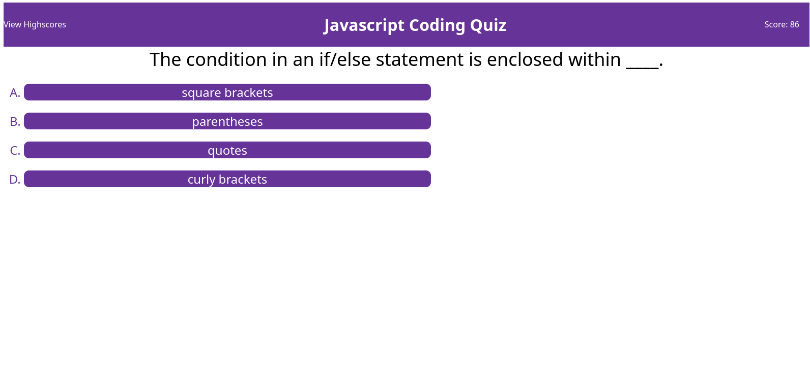

# my-code-quiz-app by Luc Tourangeau

A simple code quiz wep app with highscore functionality 

DEPLOYMENT - https://turtlenav.github.io/my-code-quiz-app/

The goal of this challenge was to create a trivia app with the following features:
* Track user score (time left on a timer upon completing the quiz)
* A game is over when the time left reaches zero OR the user answers all questions
* At the end of the game or upon clicking a "view highscores" button, view the user's score on a highscore board (if the score was high enough)
* Use localStorage to store and retrieve user scores

A demonstration of the app in-use:


stylistically, the App follows a very simple format:

[ View Highscores Button ] [ title ] [ Users' Score ]

[-------------- Question Prompt --------------------]

[-------------- Answer Choice 1 --------------------]

...

[-------------- Answer Choice N --------------------]

The HTML that builds this is very simple. However, the question and answers had to be updated dynamically and thus required some non-obvious code:

## index.html
```html
...
<main>
  <div id="container">
    <div id="question-block"></div>
    <div id="answer-block"></div>
    <div id="feedback-block"></div>
  </div>
...
```
The three \<div> elements serve as containers for certain aspects of the quiz. One can probably guess that the question/answer blocks hold the
question and answer content, respectively. The feedback block provides feedback temporarily to the user such as "correct" or "incorrect" for one second
before being cleared so as to not interfere with user play.

When rendering a question, the text content of the "question-block" div is set to the question's prompt. Within the "answer-block" div an \<ol> is rendered
and its children \<li> contain each answer choice. Upon rendering the next question all of this inner HTML is cleared and rebuilt with the number of answer
choices of that particular question.

Finally, the highscore board was built upon localStorage. Certain features of the highscore board were also built in: Sorting in ascending-order and displaying
only the top 10 highest scores. The code that achieves this is as follows:
```javascript
var highestScores = [];
var highScoreList = document.createElement("ol");
	
for (let i=0; i<localStorage.length; i++) {
  var nameT = localStorage.key(i);
  var scoreT = Number.parseFloat(localStorage.getItem(nameT));
  highestScores.push({
    name: nameT,
    score: scoreT
  });
}

// Sort our scores
highestScores.sort(function(a, b) {
  return b.score - a.score;
});

// Iterate through AT-MOST our top 10 highest scores
highestScores.slice(0, 10).forEach(function(element) {
  listEl = document.createElement("li");
  listEl.textContent = element.name + " -- " + element.score.toFixed(2).toString();
  highScoreList.appendChild(listEl);
});
```

Whenever a game is completed, the user is prompted to enter their name. Inside local storage their name is mapped to their score.
When it is time to display the highscores, each user name and score is retrieved from local storage and placed in an array. This
array is sorted using a special sorting callback. Finally, the (at-most) top 10 highest scores are retrieved and appended to an \<ol>
in the html.
